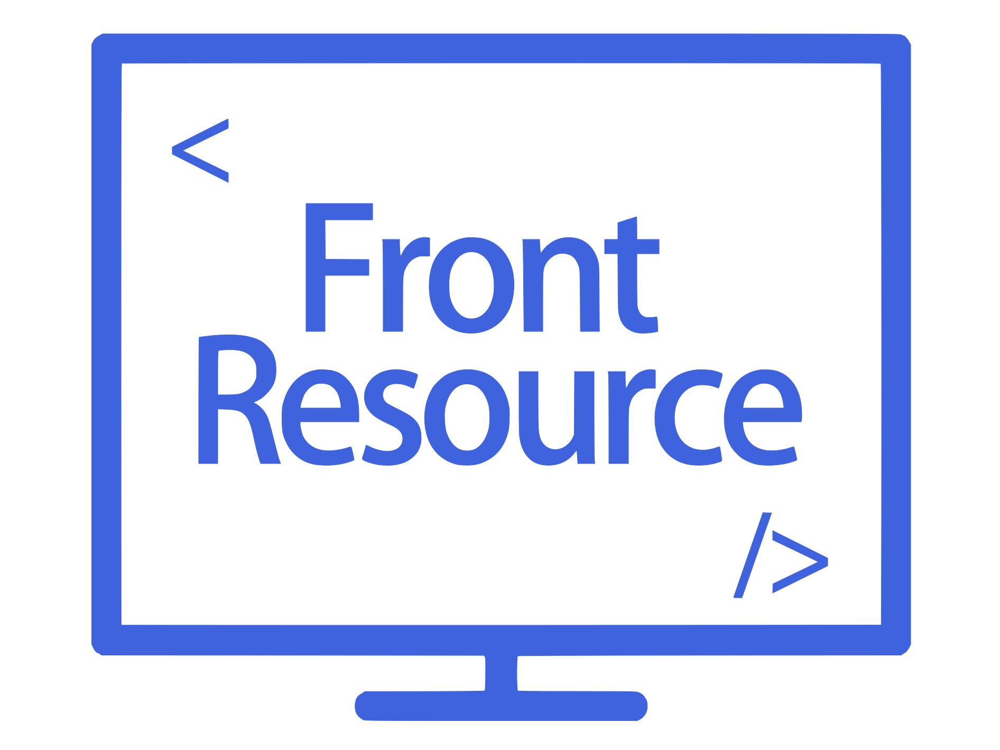

# 介绍

## 项目介绍

`FrontPress` 专注于收集前端开发的各类资源并持续更新，包含**前端工具、库、框架、设计与学习资源**等。
无论你是初学者还是资深开发者，`FrontPress` 都希望能帮助你快速找到所需的资源，提升开发效率。

## 分类
- **🛠️ 框架 / 库**：收集主流的前端开发框架和库。  
  [JavaScript 库](../framework/javascript)，[CSS 相关](../framework/css)
- **🖼️ UI / 组件库**：收集各种 UI 库、组件库、图表等，帮助快速构建界面。  
  [UI 库](../ui-component/ui-web)，[图表组件](../ui-component/component-charts)，[音频/视频组件](../ui-component/component-media)
，[图片组件](../ui-component/component-image)，[上传组件](../ui-component/component-upload)，[拖拽组件](../ui-component/component-drag)
- **🎨 设计资源**：收集与前端开发相关的设计资源，如设计工具、图标、配色方案、字体库等。
  [图标](../design/icon)，[动画](../design/animate)，[字体](../design/fonts)，[配色](../design/color)，[灵感](../design/inspiration)
- **🔨 工具与插件**：收集前端开发中常用的实用工具与插件。  
  [工具](../tools-plugin/tools)
- **📰 模板**：收集用于搭建文档站点或博客的主题模板、项目模板等。
- **🔍 学习与进步**：推荐前端开发的社区论坛、书籍课程、行业趋势等。

## 贡献指南

如果这些资源对你有帮助，希望可以给一个 `star` 支持下 [Front-Resource](https://github.com/zhenghaoyang24/Front-Resource)。
无论你是初学者还是资深开发者，你都可以通过 `issue` 或 `PR` 推荐任何相关资源。  
文档中存在一些需网络工具才可访问的链接，若任发现无法打开或链接已更新失效，
请[提交 issue](https://github.com/zhenghaoyang24/Front-Resource/issues)。

## 项目依赖

本项目主题由 [VitePress](https://vitepress.dev/zh/) 支持。  
文档徽章由开源项目[shields](https://github.com/badges/shields) 支持。  

## 访问地址

GitHub地址：[Front-Resource](https://github.com/zhenghaoyang24/Front-Resource)。  

## 贡献人员

[zhenghaoyang](https://github.com/zhenghaoyang24)
